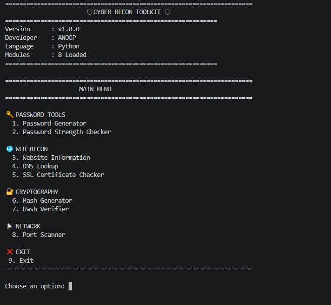
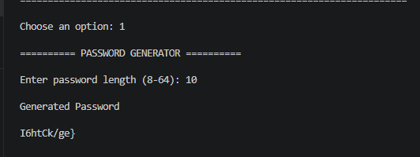
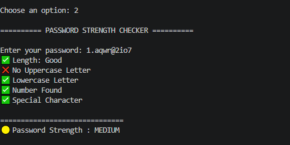
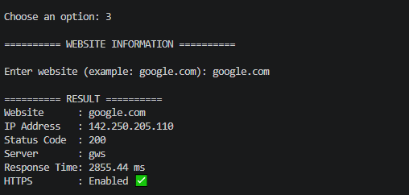
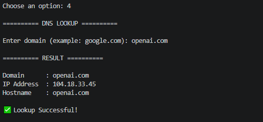
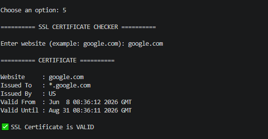
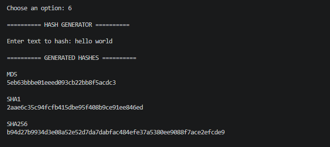
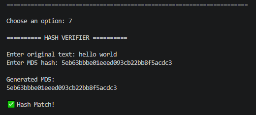
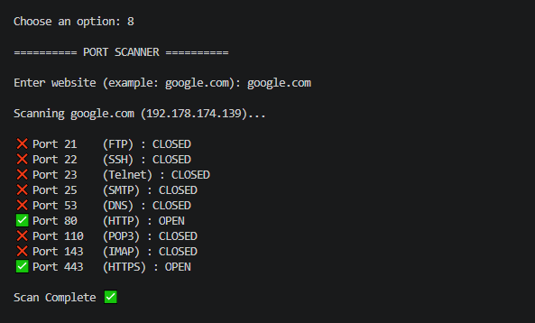

# 🛡️ Cyber Recon Toolkit

A Python-based command-line cybersecurity toolkit developed by **Anoop**.

Cyber Recon Toolkit combines multiple reconnaissance and security utilities into a single application. It is designed for cybersecurity students, ethical hacking learners, and developers who want quick access to commonly used security tools through an easy-to-use menu-driven interface.

---

# 📚 Table of Contents

* Features
* Technologies Used
* Installation
* Usage
* Screenshots
* Project Structure
* Future Improvements
* License
* Developer

---

# 🚀 Features

* 🌐 Website Information
* 🌍 DNS Lookup
* 🔒 SSL Certificate Checker
* 🔑 Password Generator
* 💪 Password Strength Checker
* #️⃣ Hash Generator
* ✔️ Hash Verifier
* 📡 Port Scanner

---

# 🛠️ Technologies Used

* Python 3
* Socket
* Requests
* SSL
* Hashlib

---

# 📦 Installation

```bash
git clone https://github.com/anoop-codex/Cyber-Recon-Toolkit.git

cd Cyber-Recon-Toolkit

pip install -r requirements.txt

python main.py
```

---

# ▶️ Usage

1. Run the toolkit.
2. Select a tool from the menu.
3. Enter the required input.
4. View the generated results.

---

## 📸 Screenshots

### Main Menu



### Password Generator



### Password Strength Checker



### Website Information



### DNS Lookup



### SSL Certificate Checker



### Hash Generator



### Hash Verifier



### Port Scanner



---

# 📁 Project Structure

```
Cyber-Recon-Toolkit/
│
├── modules/
│   ├── dns_lookup.py
│   ├── hash_generator.py
│   ├── hash_verifier.py
│   ├── password_checker.py
│   ├── password_generator.py
│   ├── port_scanner.py
│   ├── ssl_checker.py
│   └── website_info.py
│
├── main.py
├── banner.py
├── README.md
├── requirements.txt
└── .gitignore
```

---

# 🚀 Future Improvements

* WHOIS Lookup
* Subdomain Scanner
* Banner Grabbing
* Reverse DNS Lookup
* HTTP Header Analyzer
* Export Results to PDF
* Dark Mode GUI
* Flask Web Interface

---

# 📜 License

This project is licensed under the MIT License.

---

# 👨‍💻 Developer

**Anoop**

Cybersecurity Enthusiast | Python Developer | Ethical Hacking Learner

GitHub:
https://github.com/anoop-codex

---

⭐ If you like this project, consider giving it a star on GitHub!
